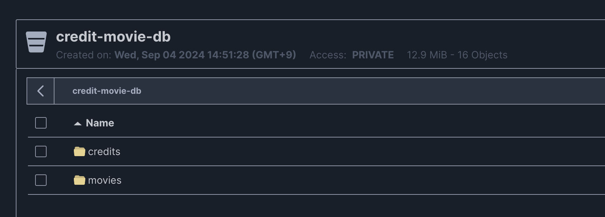
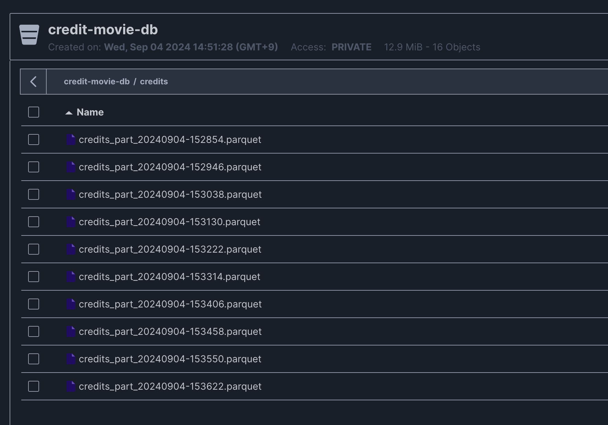
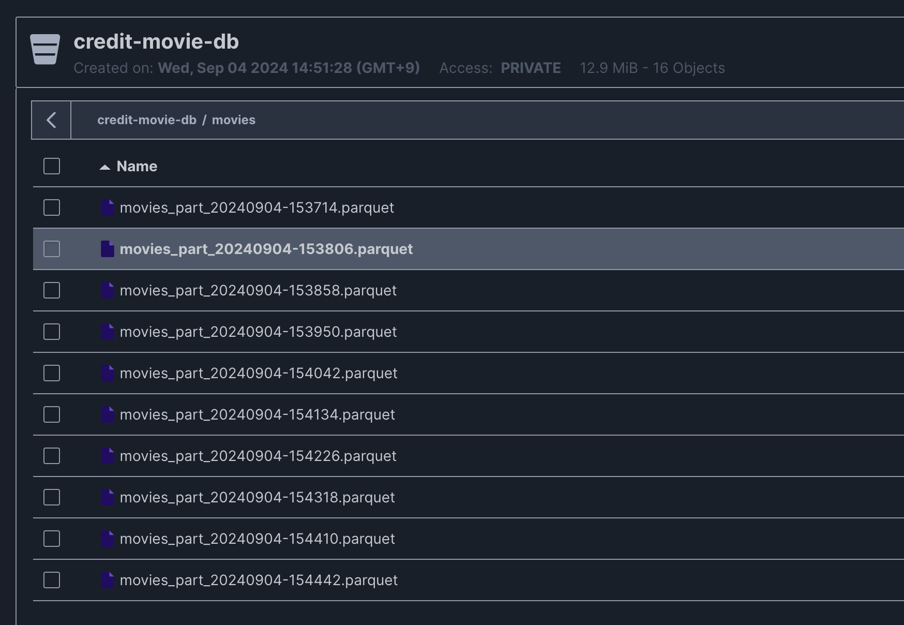

# MinIO Data Ingestion Tool

A tool for ingesting and managing data in MinIO using Apache Spark. This project enables efficient reading from and writing to MinIO, making it suitable for cloud-based big data processing and storage.

## Table of Contents

- [Overview](#overview)
- [key Technologies](#key-technologies)
- [Features](#features)
- [Installation](#installation)

## Overview







This project provides a solution for ingesting large datasets into MinIO, an object storage service. It is designed to handle data ingestion tasks efficiently. This tool can be used for scenarios like ETL (Extract, Transform, Load) pipelines, data migration, and cloud data management.

## Key Technologies
- **MinIO**: Object storage service used for storing and retrieving data.
- **Python**: The primary language for scripting and integration.

## Features

- **Efficient Data Upload**: Supports uploading large datasets to MinIO.
- **Data Reading from MinIO**: Facilitates reading data directly from MinIO for analysis or processing.
- **Configurable Data Chunk Size**: Allows specifying the size of data chunks for optimal performance.
- **Support for Local and Remote Endpoints**: Works with both local (e.g., `localhost`) and remote MinIO instances.
- **Customizable Options**: Various command-line options to configure bucket names, object keys, access keys, and more.

## Installation

To install and set up the project locally, follow these steps:

```bash
# Clone the repository
git clone https://github.com/seilylook/Data_Ingestion_with_MinIO.git

# Install dependencies
pip install -r requirements.txt
